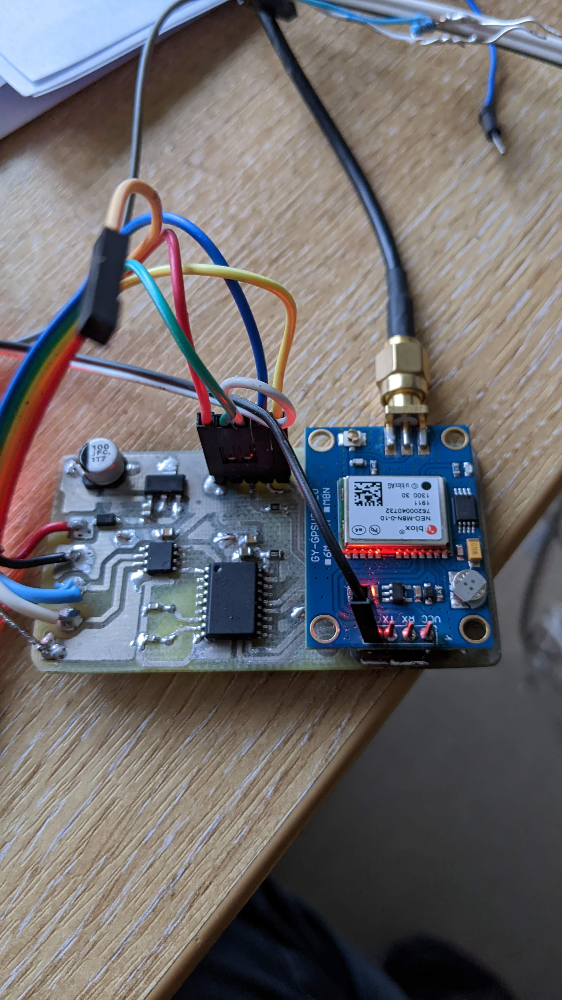

# NMEA2000 GNSS Receiver

A NMEA2000 device to provide rapid position and COG SOG update as well as other GNSS information including satelite data.

# PGN messages and rates.

* 129025L Position Rapid update 5Hz
* 129026L COG/SOG Rapid Update 2.5Hz
* 129029L Position data 1Hz
* 126992L System Time, 1Hz
* 129539L GNSS DOPs 1Hz
* 129540L GNSS Satellites in View 0.5Hz
* 127258L Magnetic Variation 1Hz

Magnetic variation is calculated every 60s from WMN2020 World model coefficients.

# Hardware

* Attiny3224 MCU
* UBlox M8N module pre configured at 19200 Baud with UBX messages.
* MCP 2515 CAN driver with TJ1050 Transceiver

# Code

Starts up, establishes CAN connectivity then reads UBX messages as they are produced and transfers them directly onto the NMEA200 bus.  There is a monitoring UART that runs at 115200 which can be used to see log messages and reboot. Press h to get a menu. The WNM2020 model takes 63ms to calculate which is long enough for a standard 64 byte UART buffer to overflow. This code requires a patched megaTinyCode code base with a 256 byte UART buffer.

# Pins

                                ANT
      --------------------------------
      |          A B C D E           |
      | F                            |
      | G                            |
      | H                            |
      | I                            |
      |                     j k l m  |
      --------------------------------

* A +5v   
* B 0v
* C UDPI
* D RX Console
* E TX Console

* F 12V - CAN
* G 0V
* H CAN-L
* I CAN-H

* j 0v
* k TX Ublox
* l RX Ublox
* m 5v Ublox

# Settings.

The MCU can program the device to its standard settings. press h to get the menu on the console. For more advanced settings u-center or pyGPSClient can be used, but first the MCU Uart connected to the Ublox module must be disabled.

Press u to disable the Uart, then without turning the device off, connect to the Ubloc TX and RX pins. The Uart will be re-enabled on reboot or power cycle.

I have found pyGPSClient to be much easier than u-center as Windows tends to grab the comp ports and GPS stream making it
almost impossible to connect u-center. (tips welcome).  So I use pyGPSClient on a Ubuntu VM running in OSX. First connect with screen to get the console

    screen /dev/ttyUSB0 115200

pres h to get the menu and u to disconnect the UART. The Ctrl-a + k  to exit screen.

Then connect pyGPSClient to the ublox via a serial and reconfigure as required.

# PCB

The PCM is designed in KiCad (ancient version), and milled on a CNC miller. The attiny3224 is underneath the ublox module, which has a ground plane on the bottom layer.

